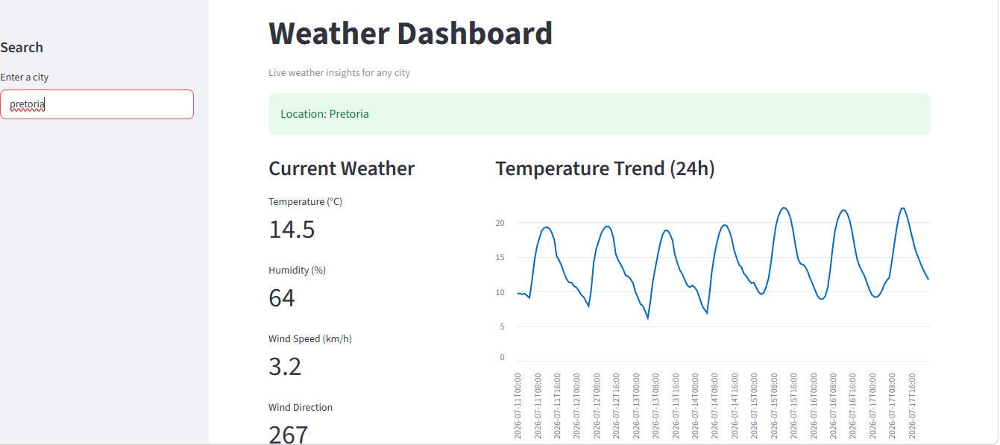
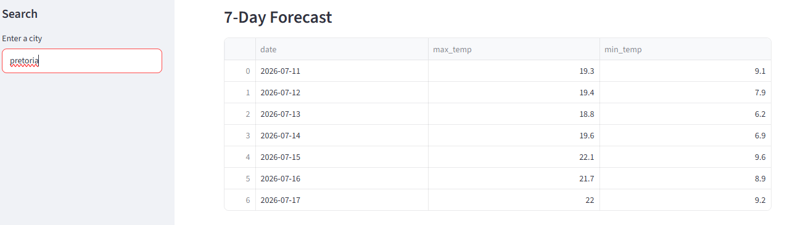
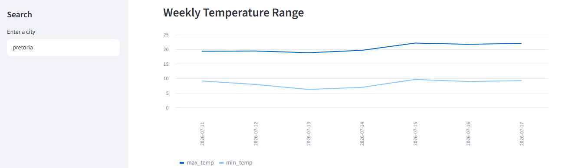
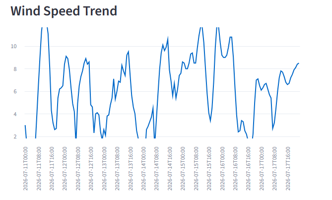

## Live Demo

https://weather-dashboard-dkwoi9dbgntchvahwiblij.streamlit.app/

# Weather Dashboard

A real-time weather dashboard built using Python and Streamlit.  
This application allows users to search for any city and view current weather conditions, trends, and forecasts.

## Features

- Search for any city worldwide
- Real-time weather data from external APIs
- Current weather metrics (temperature, wind speed, humidity)
- Interactive charts for temperature and wind trends
- 7-day weather forecast
- Clean and responsive dashboard layout

- ## Preview






## Technologies Used

- Python
- Streamlit
- Pandas
- Requests

## How It Works

1. User enters a city name
2. The app uses a geocoding API to get latitude and longitude
3. Weather data is fetched from the Open-Meteo API
4. Data is processed and displayed using charts and metrics

## Run Locally

```bash
pip install -r requirements.txt
python -m streamlit run app.py

## Author

**Rethabile Mmako**

Final-year BSc Mathematical Sciences  
Majoring in Computer Science & Statistics

## Skills Demonstrated

- API Integration
- Data Processing (Pandas)
- Data Visualization
- Web App Development (Streamlit)
- Deployment (Streamlit Cloud)


